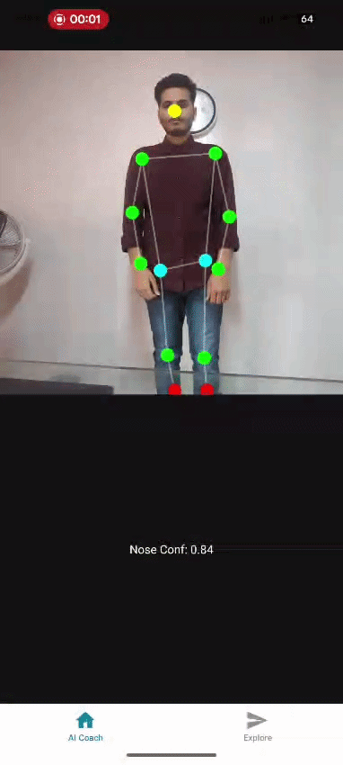

# React Native High-Performance Pose Engine (Skia) 🎨🚀

An elite-tier visualization layer for real-time biomechanical analysis. This project leverages **Shopify Skia** to render a 33-point human skeleton directly on the GPU, achieving maximum frame rates with near-zero CPU overhead.

---

## 📱 GPU-Accelerated Demo

  

_Above: Real-time skeletal rigging rendered via Skia's hardware-accelerated drawing API._

---

## 🛠️ Why Skia? (Technical Superiority)

Standard SVG rendering in React Native can bottleneck the UI thread when processing 30+ dynamic points at 60Hz. This implementation utilizes **React Native Skia** to solve the "Overhead" problem:

- **GPU Drawing:** Landmarks and "bones" are drawn as primitive paths directly on the GPU, bypassing the overhead of the React Native shadow tree.
- **Imperative Power:** Utilizing Skia's `Canvas` and `Paint` objects for high-frequency updates, ensuring the skeleton never lags behind the camera feed.
- **Memory Efficiency:** Optimized coordinate buffers to prevent garbage collection spikes during rapid movement.

---

## 🧬 Engineering Deep-Dive

To bridge the gap between AI inference and visual feedback, this PoC focuses on:

1. **Coordinate Mapping:** Translating normalized MediaPipe landmarks into Skia-space pixels.
2. **Path Optimization:** Drawing the skeleton as a single, continuous path object where possible to minimize draw calls.
3. **Visibility Filtering:** Dynamically adjusting the `opacity` of limbs based on the landmark confidence score provided by the vision engine.

---

## 🚀 Key Technical Features

- [x] **Skia Canvas Integration:** Hardware-accelerated rendering at the mobile edge.
- [x] **BlazePose Rigging:** Accurate mapping of major human keypoints.
- [x] **Low-Latency Pipeline:** Designed for real-time fitness and physical therapy applications.
- [ ] **Roadmap:** Adding Skia-based "Glow" effects and real-time angle overlays using `Skia.Text`.

---

## 🧰 Tech Stack

- **Framework:** React Native (New Architecture)
- **Graphics Engine:** [Shopify Skia](https://shopify.github.io/react-native-skia/)
- **Vision Engine:** MediaPipe / Google BlazePose
- **Language:** TypeScript
